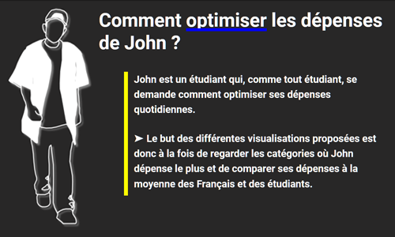

# John's Spendings Visualization

**Project done by**

Yann ALLE, Dane Clauvis BADIEL, Aurélien BRESSON, Yohan MICHELLAND

**In the context of**

Aurélien TABARD's course [Data Visualization](https://lyondataviz.github.io/teaching/lyon1-m2/2021/), during the second year of the AI Master's Degree at Université Lyon 1

**With the aim to**

Visualize the spendings of a student (John) over several years.
The 3 main goals of this visualization are:

- to be able to see in which category John is spending the most/the least
- to be able to track the evolution of John's spendings over a year
- to be able to compare those results with national data and students'

Visualiser les dépenses d'un étudiant (John) sur plusieurs années.
Les 3 buts principaux de cette visualisation sont :

- être capable de voir dans quelle catégorie John dépense le plus/le moins
- être capable de suivre l'évolution des dépenses de John au cours d'une année
- être capable de comparer ces résultats avec les données nationales et celles des étudiants.
